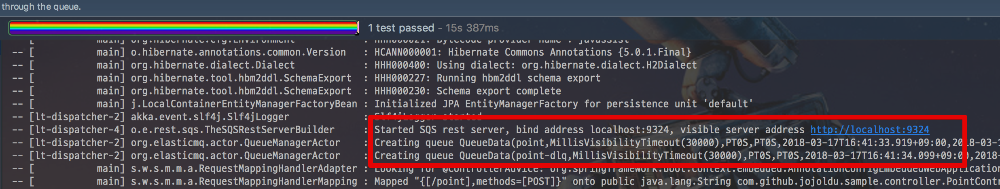

# spring-boot-aws-mock

[](https://travis-ci.org/jojoldu/spring-boot-aws-mock) [](https://coveralls.io/github/jojoldu/spring-boot-aws-mock?branch=master) [](https://jitpack.io/#jojoldu/spring-boot-aws-mock) 

Spring Boot Starter support for Amazon Web Service Mocking.

## Requirements

### 0.x, 1.x

* Java 8
* Spring Boot 1.5.x
* Spring Cloud 1.2.1

### 2.x (Not Release)

* Java 8
* Spring Boot 2.x
* Spring Cloud 2.x

## Mock Modules

* SQS
  * Amazon Simple Queue Service


## Install

Mock SQS

```groovy
repositories {
    maven { url 'https://jitpack.io' }
}

dependencies {
    compile 'com.github.jojoldu.spring-boot-aws-mock:spring-boot-starter-mock-sqs:0.0.8'
}
```

## Usage

### Default

application.yml

```yml
cloud:
  aws:
    region:
      static: ap-northeast-2 //aws region code (required)

sqs:
  mock:
    enabled: true //required
  queues: {
    "key1dlq": {
      "name": "key1-dlq"
    },
    "key1": {
      "name": "key1",
      "defaultVisibilityTimeout": 1,
      "delay": 0,
      "receiveMessageWait": 0,
      "deadLettersQueue": {
        "name": "key1-dlq",
        "maxReceiveCount": 1
      }
    }
  }
```

Controller.java

```java
public class SampleController {
    @Autowired private QueueMessagingTemplate messagingTemplate;
    @Autowired private SqsQueues sqsQueues; // Queue name Collection Object

    @PostMapping("/url")
    public String save(@RequestBody RequestDto requestDto){
        String queueName = sqsQueues.getQueueName("key1");
        messagingTemplate.convertAndSend(queueName, requestDto);
        ...
    }

    @SqsListener(value = "${sqs.queue.key1.name}")
    public void receive(String message, @Header("SenderId") String senderId) throws IOException {
        ...
    }
}
```

Run Test & Show Log




### Options

```yml
sqs:
  mock:
    enabled: true //required
  queues: {
    "key1dlq": {
      "name": "key1-dlq"
    },
    "key1": {
      "name": "key1",
      "defaultVisibilityTimeout": 1,
      "delay": 0,
      "receiveMessageWait": 0,
      "deadLettersQueue": {
        "name": "key1-dlq",
        "maxReceiveCount": 1
      }
    }
  }
```

* sqs.mock.enabled = true // Required
      
| AWS SQS                       | MOCK SQS                         | Default Value |
|-------------------------------|----------------------------------|---------------|
| VisibilityTimeout             | defaultVisibilityTimeout         | 30 (s)        |
| DelaySeconds                  | delay                            | 0  (s)        |
| ReceiveMessageWaitTimeSeconds | receiveMessageWait               | 0  (s)        |
| RedrivePolicy                 | deadLettersQueue                 | null          |
| RedrivePolicy.name            | deadLettersQueue.name            | null          |
| RedrivePolicy.maxReceiveCount | deadLettersQueue.maxReceiveCount | null          |
## Example

[Sample Project](https://github.com/jojoldu/spring-boot-aws-mock/tree/master/spring-boot-starter-mock-sample)


